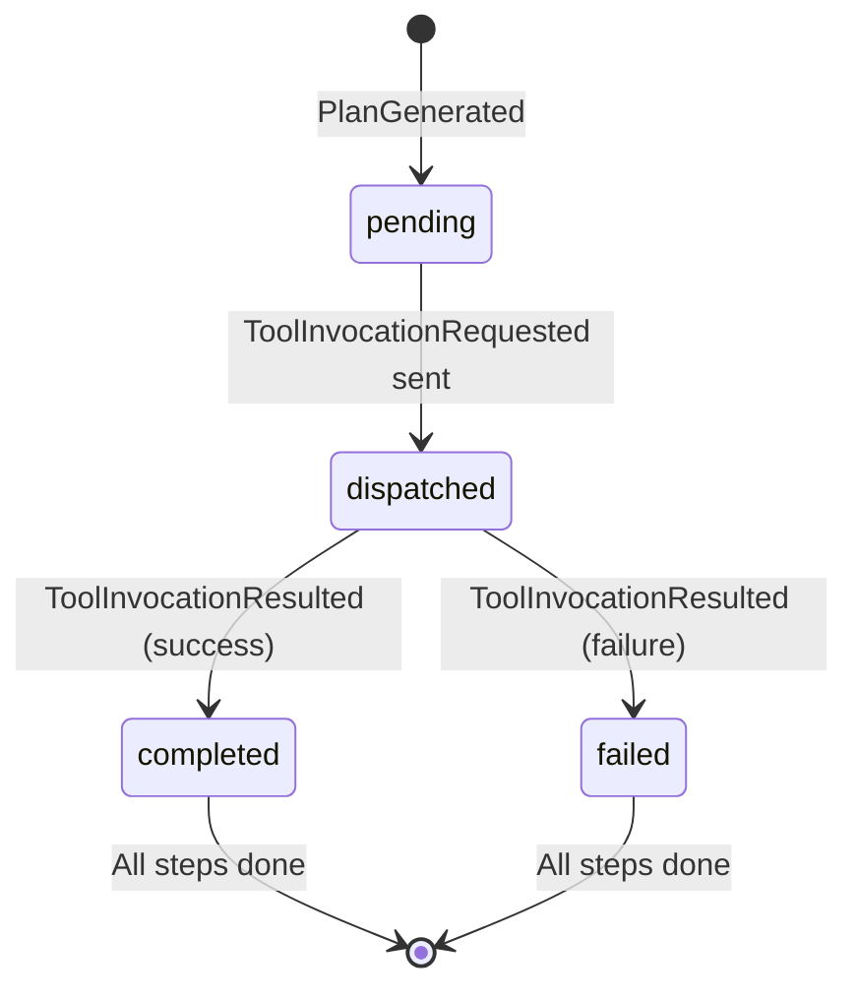

# Project Documentation — Deep Dive

## 1. The Paradigm Shift

This project migrated from a **synchronous linear pipeline** to an **asynchronous Event-Sourced State Machine**.

### Before: Linear Pipeline

```
User → Gateway → RouterService → MemoryService → Worker → Aggregator → User
```

Each service consumed from one Kafka topic and produced to the next. The flow was rigid, synchronous in concept, and single-step only (one tool per query).

### After: Event-Sourced State Machine

```
User → Gateway → [user-commands] → Router Agent → [PlanGenerated]
  → Orchestrator ←→ [ToolInvocationRequested/Resulted] ←→ Workers
  → [SynthesizeFinalAnswerRequested] → Aggregator → User
```

The new architecture is:

- **Multi-step**: A single query can invoke multiple tools in sequence.
- **Event-sourced**: `conversation-events` is the single source of truth. State is derived, not stored.
- **Recoverable**: The Orchestrator can rehydrate its in-memory state by replaying the event log after a crash.
- **Decoupled**: Workers know nothing about each other or the plan. They simply receive a command and return a result.

---

## 2. Topic Taxonomy

### Event-Sourced Topics (New)

| Topic                      | Wire Name                  | Purpose                                           | Partitions | Retention |
| -------------------------- | -------------------------- | ------------------------------------------------- | ---------- | --------- |
| `user-commands`            | `user-commands`            | Inbound user queries from the Gateway             | 3          | Default   |
| `conversation-events`      | `conversation-events`      | **Single Source of Truth** — all events live here | 3          | 7 days    |
| `tool-invocation-requests` | `tool-invocation-requests` | CQRS command channel — Orchestrator → Workers     | 3          | Default   |
| `dead-letter-queue`        | `dead-letter-queue`        | Failed/unprocessable messages                     | 1          | Default   |

### Legacy Topics (Preserved for backward compatibility)

| Topic                         | Purpose                                                                             |
| ----------------------------- | ----------------------------------------------------------------------------------- |
| `user_input_events`           | Original user input (no longer used by Gateway)                                     |
| `bot_output_events`           | Bot responses consumed by the UI (**still active** — Aggregator dual-produces here) |
| `user_control_events`         | Reset commands                                                                      |
| `router_decision_events`      | Router classification logging                                                       |
| `enriched_execution_requests` | Memory-enriched intents                                                             |
| `app_results`                 | Worker results (legacy)                                                             |

---

## 3. Event Schemas

All events are validated with **Zod** schemas before production and after consumption. The schemas are defined in `packages/services/shared/event-schemas.ts`.

### Base Event Structure

Every event on `conversation-events` extends this base:

```typescript
{
  eventType: string;        // Discriminator
  correlationId: string;    // UUID linking all events in one flow
  timestamp: number;        // Unix epoch ms
  payload: { ... };         // Event-specific data
}
```

### Event Types

| #   | Event                            | Producer     | Consumer     | Payload                                                                    |
| --- | -------------------------------- | ------------ | ------------ | -------------------------------------------------------------------------- |
| 1   | `UserQueryReceived`              | Gateway      | Router Agent | `{ userId, query, conversationId }`                                        |
| 2   | `PlanGenerated`                  | Router Agent | Orchestrator | `{ conversationId, originalQuery, plan: { planId, steps[], totalSteps } }` |
| 3   | `ToolInvocationRequested`        | Orchestrator | Workers      | `{ planId, stepIndex, toolName, toolInput, conversationId }`               |
| 4   | `ToolInvocationResulted`         | Workers      | Orchestrator | `{ planId, stepIndex, toolName, result, success, durationMs }`             |
| 5   | `PlanCompleted`                  | Orchestrator | (Event Log)  | `{ planId, conversationId, originalQuery, results[], totalDurationMs }`    |
| 6   | `SynthesizeFinalAnswerRequested` | Orchestrator | Aggregator   | `{ planId, conversationId, originalQuery, toolResults[] }`                 |
| 7   | `FinalAnswerSynthesized`         | Aggregator   | (Event Log)  | `{ conversationId, finalAnswer }`                                          |

> **Note:** `ToolInvocationRequested` lives on its own topic (`tool-invocation-requests`), not on `conversation-events`. This is the CQRS command channel.

---

## 4. Component Deep Dive

### 4.1 Gateway (UserInterface Service)

**Location:** `packages/services/user-interface/userInterface.ts`

The Gateway bridges the Express HTTP API with the Kafka event bus.

- **Producer:** Converts HTTP requests into `UserQueryReceived` events and publishes to `user-commands`.
- **Consumer:** Listens to `bot_output_events` for `BotResponseMessage` and resolves the pending HTTP response using correlation ID matching.
- **Timeout:** 45 seconds (configurable) to accommodate multi-step plans.

### 4.2 Router Agent (Plan Generator)

**Location:** `packages/services/router-agent/src/`

The Router Agent is the "brain" that decomposes a user query into an execution plan.

**Flow:**

1. Consumes `UserQueryReceived` from `user-commands`.
2. Sends the query + system prompt to GPT-4o-mini with strict JSON output mode.
3. The LLM returns a structured plan with one or more steps.
4. Validates the LLM output against `PlanGeneratedSchema` (Zod).
5. On validation failure, falls back to a single `general_chat` step.
6. Produces `PlanGenerated` to `conversation-events`.

**Available Tools:**

| Tool           | Description                            |
| -------------- | -------------------------------------- |
| `math`         | Arithmetic and word problems           |
| `weather`      | Weather data for any city              |
| `rag`          | Product search via semantic similarity |
| `general_chat` | General conversation (fallback)        |

**Prompt Engineering:** The system prompt includes 5 few-shot examples and strict JSON schema requirements. See `packages/services/router-agent/src/prompts.ts`.

### 4.3 Orchestrator (Stateful Plan Orchestrator)

**Location:** `packages/services/orchestrator-service/src/`

The Orchestrator is the "heart" of the system — a stateful plan execution engine.

**State Machine:**



**Key Features:**

- **In-memory state** (`Map<correlationId, PlanState>`) tracks each plan's progress.
- **Idempotent handlers:** Safe to replay events without side effects.
- **Step dependencies:** Supports `dependsOn` arrays for future DAG execution.
- **Garbage collection:** Plans older than 30 minutes are automatically cleaned up (every 5 minutes).

**Crash Recovery (Rehydration):**

On startup, the Orchestrator:

1. Creates a **temporary consumer** with a unique group ID.
2. Reads the **entire** `conversation-events` topic from the beginning.
3. Replays `PlanGenerated` and `ToolInvocationResulted` events to rebuild state.
4. Switches to live consumption from the main consumer group.

This ensures zero data loss across restarts.

### 4.4 Workers

All workers follow the same CQRS pattern:

1. Consume from `tool-invocation-requests`.
2. Filter by `toolName` (each worker only handles its own tool).
3. Execute the business logic.
4. Produce `ToolInvocationResulted` to `conversation-events`.

#### Math Worker

- **Location:** `packages/services/workers/math-app/mathApp.ts`
- **Logic:** Safe expression evaluation with Chain-of-Thought reasoning for word problems.
- **LLM:** Uses GPT-4o-mini to extract math expressions from natural language.

#### Weather Worker

- **Location:** `packages/services/workers/weather-app/weatherApp.ts`
- **Logic:** Two-step API call — geocoding via Open-Meteo, then weather data fetch.
- **No LLM needed** — purely API-driven.

#### General Chat Worker

- **Location:** `packages/services/workers/general-chat-app/generalChatApp.ts`
- **Logic:** Direct OpenAI conversation with a "Cynical Data Engineer" persona.
- **Fallback:** Acts as the catch-all for any query that doesn't match other tools.

#### RAG Worker (Python)

- **Location:** `packages/services/workers/rag-worker/`
- **Runtime:** Python 3.11 (Docker container)
- **Stack:** `kafka-python-ng`, `chromadb==0.5.5`, `sentence-transformers`
- **Flow:**
   1. On startup, ingests text files from `data/products/` into ChromaDB.
   2. Embeddings are generated locally using `all-MiniLM-L6-v2`.
   3. On query, retrieves the 3 most relevant chunks via cosine similarity.
   4. Returns the context chunks as the tool result.
- **Kafka Configuration:** Uses the internal Docker listener (`kafka:29092`) for container-to-container communication.

### 4.5 Aggregator (Synthesis Agent)

**Location:** `packages/services/aggregator/src/`

The Aggregator is the "voice" of the system — it turns raw tool results into a human-friendly response.

**Flow:**

1. Consumes `SynthesizeFinalAnswerRequested` from `conversation-events`.
2. Sends the original query + all tool results to GPT-4o-mini with a synthesis prompt.
3. Gracefully handles tool failures (acknowledges issues without exposing internals).
4. Matches the language of the user's original query (Hebrew/English).
5. **Dual Production:**
   - `FinalAnswerSynthesized` → `conversation-events` (event log)
   - `BotResponseMessage` → `bot_output_events` (legacy UI support)

---

## 5. Message Flow Example

When a user asks **"I need a laptop for gaming under $2000"**:

```
1. [Gateway]     → UserQueryReceived         → user-commands
2. [Router]      → PlanGenerated             → conversation-events
                    Plan: [{ tool: "rag", input: "gaming laptop under $2000" }]
3. [Orchestrator]→ ToolInvocationRequested   → tool-invocation-requests
                    Dispatching: rag (step 0)
4. [RAG Worker]  → ToolInvocationResulted    → conversation-events
                    Result: "TechPro UltraBook X15..." (3 chunks)
5. [Orchestrator]→ PlanCompleted             → conversation-events
                 → SynthesizeFinalAnswerReq. → conversation-events
6. [Aggregator]  → FinalAnswerSynthesized    → conversation-events
                 → BotResponseMessage        → bot_output_events
7. [Gateway]     → HTTP Response             → React UI
```

Total latency: ~3-8 seconds (dominated by LLM calls).

---

## 6. API Endpoints

### Chat Endpoint

|            |             |
| ---------- | ----------- |
| **Method** | `POST`      |
| **Path**   | `/api/chat` |

**Request:**

```json
{
   "prompt": "I need a laptop for gaming under $2000",
   "conversationId": "123e4567-e89b-12d3-a456-426614174000"
}
```

**Response:**

```json
{
   "id": "msg_1234567890_abc",
   "message": "Based on your requirements, the TechPro UltraBook X15 at $1,799..."
}
```

### Reset Endpoint

|             |                             |
| ----------- | --------------------------- |
| **Method**  | `DELETE`                    |
| **Path**    | `/api/chat/reset`           |
| **Purpose** | Clears conversation history |

---

## 7. Testing

### E2E Flow Test

The `test-full-flow.ts` script simulates the full pipeline without the UI:

```bash
bun run packages/services/shared/test-full-flow.ts
```

**What it does:**

1. Produces a `UserQueryReceived` event to `user-commands`.
2. Consumes `conversation-events` and logs every event matching the test's correlation ID.
3. Prints a color-coded trace with emoji indicators for each event type.
4. Exits automatically 2 seconds after receiving `FinalAnswerSynthesized`.

### Schema Validation Tests

```bash
bun run packages/services/shared/test-schemas.ts
```

Runs 15 unit tests validating all Zod event schemas with both valid and invalid payloads.

---

## 8. Configuration

### Environment Variables

| Variable         | Required | Description                                             |
| ---------------- | -------- | ------------------------------------------------------- |
| `OPENAI_API_KEY` | ✅       | OpenAI API key for Router, General Chat, and Aggregator |
| `PORT`           | ❌       | Express server port (default: `3000`)                   |
| `KAFKA_BROKERS`  | ❌       | Kafka broker address (default: `localhost:9092`)        |

### Docker Services

| Service    | Port                              | Purpose                  |
| ---------- | --------------------------------- | ------------------------ |
| Kafka      | `9092` (host), `29092` (internal) | Event bus                |
| Zookeeper  | `2181`                            | Kafka coordination       |
| ChromaDB   | `8000`                            | Vector database for RAG  |
| RAG Worker | —                                 | Python worker (internal) |

---

## 9. Technology Stack

| Layer          | Technology             | Version          |
| -------------- | ---------------------- | ---------------- |
| Runtime        | Bun                    | 1.0+             |
| Language       | TypeScript             | 5.x              |
| Language (RAG) | Python                 | 3.11             |
| Frontend       | React + Vite           | 19.x             |
| CSS            | Tailwind CSS           | 4.x              |
| Gateway        | Express.js             | 4.x              |
| Messaging      | Apache Kafka (KafkaJS) | 2.2.x            |
| AI             | OpenAI API             | GPT-4o-mini      |
| Vector DB      | ChromaDB               | 0.5.5            |
| Embeddings     | Sentence Transformers  | all-MiniLM-L6-v2 |
| Validation     | Zod                    | 4.x              |
| Container      | Docker Compose         | 3.x              |
