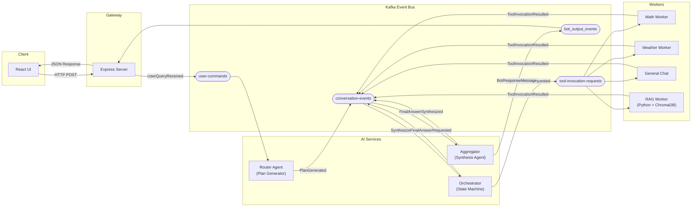

# 🧠 Event-Sourced AI Agent Platform


A distributed AI chatbot platform built on an **Event-Sourced State Machine** architecture. User queries are decomposed into multi-step execution plans by an LLM, orchestrated through Kafka, executed by specialized workers, and synthesized into a final answer — all with full event replay and crash recovery.

---

## Architecture



---

## Key Features

| Feature                    | Description                                                                                                               |
| -------------------------- | ------------------------------------------------------------------------------------------------------------------------- |
| **Event Sourcing**         | `conversation-events` is the single source of truth. All state is derived from the event log.                             |
| **CQRS**                   | Workers consume commands (`ToolInvocationRequested`) and produce results (`ToolInvocationResulted`) on separate channels. |
| **Stateful Orchestration** | In-memory state machine tracks multi-step plan progress with event-sourced rehydration for crash recovery.                |
| **LLM-Powered Planning**   | Router Agent uses GPT-4o-mini to generate structured JSON execution plans with tool selection.                            |
| **Local RAG**              | Python worker with ChromaDB + Sentence Transformers for semantic product search (no external vector DB needed).           |
| **Resilience**             | Dead-letter queue, idempotent handlers, Zod schema validation on every event, and auto-reconnect.                         |
| **Dual Production**        | Aggregator produces to both the event log and the legacy `bot_output_events` topic for backward-compatible UI support.    |

---

## Tech Stack

| Layer      | Technology                               |
| ---------- | ---------------------------------------- |
| Runtime    | Bun                                      |
| Language   | TypeScript, Python                       |
| Frontend   | React 19, Vite, Tailwind CSS 4           |
| Gateway    | Express.js                               |
| Messaging  | Apache Kafka (KafkaJS)                   |
| AI         | OpenAI API (GPT-4o-mini)                 |
| Vector DB  | ChromaDB 0.5.5                           |
| Embeddings | Sentence Transformers (all-MiniLM-L6-v2) |
| Validation | Zod                                      |
| Container  | Docker Compose                           |

---

## Quick Start

### Prerequisites

- [Bun](https://bun.sh/) (v1.0+)
- [Docker Desktop](https://www.docker.com/products/docker-desktop/)
- OpenAI API Key (in `.env` at project root)

```env
# .env
OPENAI_API_KEY=sk-your-key-here
```

### 1. Start Infrastructure

```bash
# Start Kafka + Zookeeper + ChromaDB
docker compose up -d
```

### 2. Initialize Kafka Topics

```bash
bun run init-topics
```

### 3. Start Services

Open separate terminals for each group:

```bash
# Terminal 1 — Legacy services (Client, Server, Workers, Aggregator)
bun run start-services

# Terminal 2 — Router Agent (Plan Generator)
bun run packages/services/router-agent/src/service.ts

# Terminal 3 — Orchestrator (State Machine)
bun run packages/services/orchestrator-service/src/service.ts

# Terminal 4 — RAG Worker (Python, runs in Docker)
docker compose up rag-worker
```

### 4. Open the App

Navigate to **http://localhost:5173**

---

## End-to-End Testing

Run the E2E simulation script to verify the entire pipeline without the UI:

```bash
bun run packages/services/shared/test-full-flow.ts
```

This sends a test query through the system and prints a color-coded trace of every event in the pipeline, ending with the synthesized final answer.

---

## Project Structure

```
my-app/
├── packages/
│   ├── client/                          # React Frontend (Vite)
│   ├── server/                          # Express Gateway
│   └── services/
│       ├── shared/                      # Kafka client, topics, schemas
│       │   ├── kafka-client.ts
│       │   ├── kafka-topics.ts
│       │   ├── event-schemas.ts         # Zod schemas for all events
│       │   ├── init-topics.ts
│       │   └── test-full-flow.ts        # E2E test script
│       ├── user-interface/              # Kafka ↔ Express bridge
│       ├── router-agent/                # LLM Plan Generator
│       ├── orchestrator-service/        # Stateful Plan Orchestrator
│       ├── aggregator/                  # LLM Synthesis Agent
│       └── workers/
│           ├── math-app/                # Math calculations
│           ├── weather-app/             # Open-Meteo API
│           ├── general-chat-app/        # OpenAI conversation
│           └── rag-worker/              # Python RAG (ChromaDB)
├── data/products/                       # RAG data files
├── docker-compose.yml
└── .env
```

---

## License

MIT
