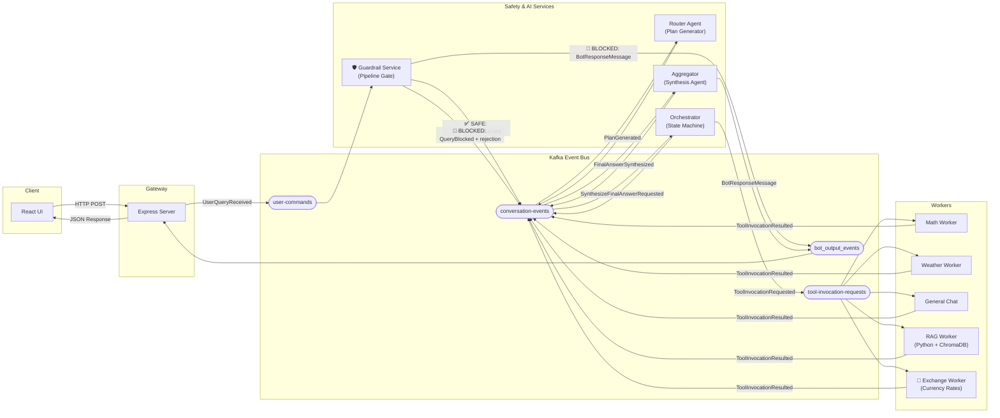

# 🧠 Event-Sourced AI Agent Platform


A distributed AI chatbot platform built on an **Event-Sourced State Machine** architecture. User queries are decomposed into multi-step execution plans by an LLM, guarded by a safety guardrail, orchestrated through Kafka, executed by specialized workers, and synthesized into a final answer — all with full event replay and crash recovery.

---

## Architecture



### Guardrail Gate Pattern

The **Guardrail Service** is the first and only consumer of `user-commands`. It acts as a mandatory gate — nothing reaches the Router without passing through it first.

```
user-commands
      │
      ▼
 GuardrailService
      ├─── SAFE ──────► conversation-events (UserQueryReceived) → Router → normal flow
      └─── BLOCKED ───► conversation-events (QueryBlocked)       ← audit trail
                      → bot_output_events  (rejection message)   ← UI notified instantly
```

---

## Key Features

| Feature                    | Description                                                                                                                                                                                                  |
| -------------------------- | ------------------------------------------------------------------------------------------------------------------------------------------------------------------------------------------------------------ |
| **🛡️ Safety Guardrail**    | Keyword-based gate intercepts `user-commands` before the Router. Blocks political/malware content and immediately sends a rejection to the UI (no hanging).                                                  |
| **🔀 Hybrid RAG Search**   | ChromaDB product queries support metadata pre-filtering (`price`, `rating`, `purpose`) before semantic similarity ranking, enabling queries like "gaming laptops under $1500 rated 4.5+".                    |
| **💱 Currency Worker**     | Fully integrated into the ES pipeline. The Router can generate multi-step plans combining RAG product search with live currency conversion (e.g., "Recommend a gaming laptop and tell me its price in ILS"). |
| **Event Sourcing**         | `conversation-events` is the single source of truth. All state is derived from the event log.                                                                                                                |
| **CQRS**                   | Workers consume commands (`ToolInvocationRequested`) and produce results (`ToolInvocationResulted`) on separate channels.                                                                                    |
| **Stateful Orchestration** | In-memory state machine tracks multi-step plan progress with event-sourced rehydration for crash recovery.                                                                                                   |
| **LLM-Powered Planning**   | Router Agent uses GPT-4o-mini to generate structured JSON execution plans with tool selection.                                                                                                               |
| **Resilience**             | Dead-letter queue, idempotent handlers, Zod schema validation on every event, and auto-reconnect.                                                                                                            |

---

## Tech Stack

| Layer      | Technology                               |
| ---------- | ---------------------------------------- |
| Runtime    | Bun                                      |
| Language   | TypeScript, Python                       |
| Frontend   | React 19, Vite, Tailwind CSS 4           |
| Gateway    | Express.js                               |
| Messaging  | Apache Kafka (KafkaJS)                   |
| AI         | OpenAI API (GPT-4o-mini)                 |
| Vector DB  | ChromaDB 0.5.5                           |
| Embeddings | Sentence Transformers (all-MiniLM-L6-v2) |
| Validation | Zod                                      |
| Container  | Docker Compose                           |

---

## Quick Start

### Prerequisites

- [Bun](https://bun.sh/) (v1.0+)
- [Docker Desktop](https://www.docker.com/products/docker-desktop/)
- OpenAI API Key

```env
# .env (at project root)
OPENAI_API_KEY=sk-your-key-here
```

---

### Step 1 — Start Infrastructure

Start Kafka (KRaft mode) and ChromaDB:

```bash
docker compose up -d kafka chromadb
```

---

### Step 2 — Initialize Kafka Topics

Creates all required topics (`user-commands`, `conversation-events`, `tool-invocation-requests`, `bot_output_events`, `dead-letter-queue`, etc.):

```bash
bun run init-topics
```

---

### Step 3 — Start the ES Pipeline Services

Open a separate terminal for **each** of the following services. The order matters — start infrastructure services first.

#### Terminal 1 — Frontend + Express Gateway

```bash
# Starts React UI (http://localhost:5173) + Express API server (http://localhost:3000)
bun run dev
```

#### Terminal 2 — 🛡️ Guardrail Service _(start before the Router)_

```bash
# The pipeline gate — must be running before any traffic flows
bun run packages/services/guardrail-service/guardrailService.ts
```

#### Terminal 3 — Router Agent (Plan Generator)

```bash
# Consumes UserQueryReceived from conversation-events, generates multi-step plans
bun run packages/services/router-agent/src/service.ts
```

#### Terminal 4 — Orchestrator (State Machine)

```bash
# Drives plan execution, dispatches ToolInvocationRequested commands
bun run packages/services/orchestrator-service/src/service.ts
```

#### Terminal 5 — Aggregator (Synthesis Agent)

```bash
# Synthesizes all tool results into a final natural language answer
bun run packages/services/aggregator/src/service.ts
```

#### Terminal 6 — TypeScript Workers (Math, Weather, Currency, General Chat)

```bash
# Runs all TS workers concurrently via the legacy start-services script
bun run start-services
```

> **Note:** `start-services` also launches the Guardrail, Router, and legacy services. If you only need the ES-pipeline workers individually:
>
> ```bash
> bun run packages/services/workers/math-app/mathApp.ts
> bun run packages/services/workers/weather-app/weatherApp.ts
> bun run packages/services/workers/exchange-app/exchangeApp.ts
> bun run packages/services/workers/general-chat-app/generalChatApp.ts
> ```

#### Terminal 7 — RAG Worker (Python + ChromaDB)

```bash
# First run: build the Docker image and ingest product data
docker compose up rag-worker --build

# Subsequent runs (no rebuild needed)
docker compose up rag-worker

# First run AFTER updating laptops.txt (forces re-ingestion):
docker compose run --rm -e FORCE_REINGEST=true rag-worker
```

---

### Step 4 — Open the App

Navigate to **http://localhost:5173**

---

## Example Queries

| Query                                                      | Tools Used         | What Happens                                                          |
| ---------------------------------------------------------- | ------------------ | --------------------------------------------------------------------- |
| `"Recommend a gaming laptop and tell me its price in ILS"` | `rag` → `currency` | 2-step plan: semantic+filtered product search, then ILS exchange rate |
| `"Find me a student laptop under $500"`                    | `rag`              | Filtered search: `purpose=student`, `max_price=500`                   |
| `"What's the weather in London and calculate 15*8?"`       | `weather` + `math` | 2 parallel steps combined into one answer                             |
| `"Who should I vote for?"`                                 | _(blocked)_        | Guardrail intercepts — instant rejection, UI never hangs              |
| `"What is 125 divided by 5?"`                              | `math`             | Single step chain-of-thought math                                     |

---

## Hybrid RAG — Metadata Filters

The RAG worker supports structured pre-filtering before semantic ranking. The Router Agent automatically populates these fields based on the user's query:

| Filter       | Type        | Example                                                              |
| ------------ | ----------- | -------------------------------------------------------------------- |
| `purpose`    | string      | `"gaming"`, `"student"`, `"programming"`, `"business"`, `"creative"` |
| `min_rating` | float       | `4.5` → only products rated ≥ 4.5/5                                  |
| `max_price`  | float (USD) | `1000` → only products ≤ $1,000                                      |

---

## Event Reference

| Event                            | Topic                      | Producer → Consumer                   |
| -------------------------------- | -------------------------- | ------------------------------------- |
| `UserQueryReceived`              | `user-commands`            | Gateway → Guardrail                   |
| `UserQueryReceived`              | `conversation-events`      | Guardrail (safe) → Router             |
| `QueryBlocked`                   | `conversation-events`      | Guardrail (blocked) → audit           |
| `PlanGenerated`                  | `conversation-events`      | Router → Orchestrator                 |
| `ToolInvocationRequested`        | `tool-invocation-requests` | Orchestrator → Workers                |
| `ToolInvocationResulted`         | `conversation-events`      | Workers → Orchestrator                |
| `SynthesizeFinalAnswerRequested` | `conversation-events`      | Orchestrator → Aggregator             |
| `FinalAnswerSynthesized`         | `conversation-events`      | Aggregator → event log                |
| `BotResponseMessage`             | `bot_output_events`        | Aggregator / Guardrail → Gateway → UI |

---

## Project Structure

```
my-app/
├── packages/
│   ├── client/                          # React Frontend (Vite)
│   ├── server/                          # Express Gateway
│   └── services/
│       ├── shared/                      # Kafka client, topics, Zod schemas
│       │   ├── event-schemas.ts         # All event types + validation
│       │   ├── kafka-topics.ts          # Topic name constants
│       │   ├── kafka-client.ts          # Producer/Consumer factory
│       │   ├── init-topics.ts           # Topic initialization script
│       │   └── test-full-flow.ts        # E2E test script
│       ├── guardrail-service/           # 🛡️ Pipeline Gate (keyword filter)
│       ├── router-agent/                # LLM Plan Generator (GPT-4o-mini)
│       ├── orchestrator-service/        # Stateful Plan Orchestrator
│       ├── aggregator/                  # LLM Synthesis Agent
│       └── workers/
│           ├── math-app/                # Math calculations
│           ├── weather-app/             # Open-Meteo API
│           ├── exchange-app/            # 💱 Currency rates (ES pipeline)
│           ├── general-chat-app/        # OpenAI conversation
│           └── rag-worker/              # Python: ChromaDB + Hybrid Search
├── data/products/
│   └── laptops.txt                      # 16 laptop products with metadata
├── docker-compose.yml                   # Kafka, ChromaDB, RAG Worker
└── .env                                 # OPENAI_API_KEY
```

---

## End-to-End Testing

Run the E2E simulation script to verify the entire pipeline without the UI:

```bash
bun run packages/services/shared/test-full-flow.ts
```

This sends a test query through the system and prints a color-coded trace of every event in the pipeline, ending with the synthesized final answer.

---

## License

MIT
